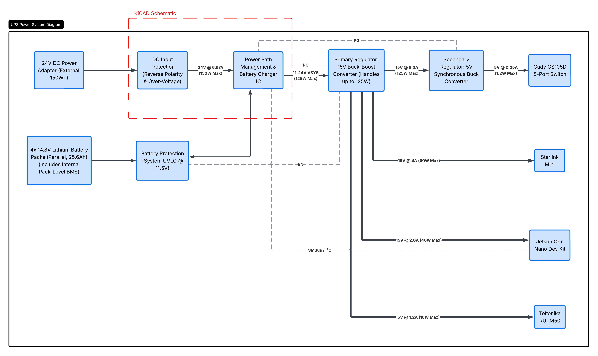
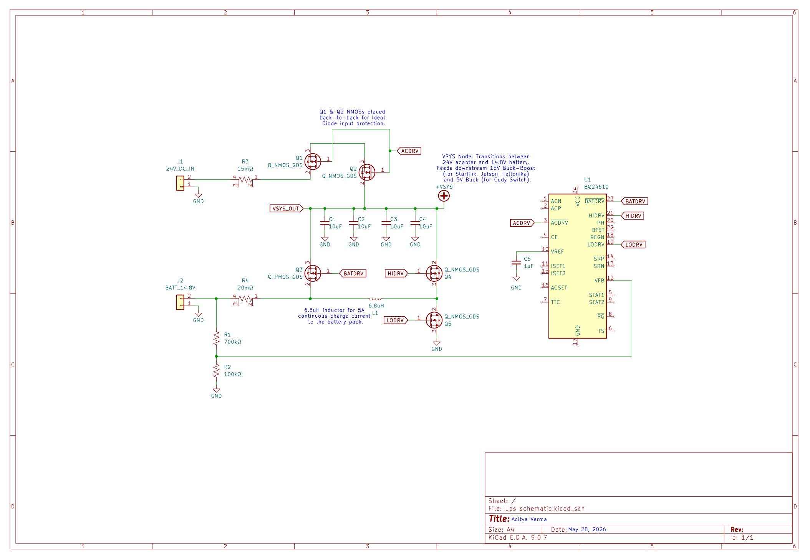

# UPS Design, Take Home Project - Aditya Verma

## 1. Problem Statement
This project upgrades a portable communication system's power supply to a custom PCB. The system should act as an uninterruptible power supply, and automatically switch between a wall charger and a lithium battery bank to keep several devices running. These devices include a Starlink Mini, a Jetson Nano, a router, and a network switch. The main task is to design the power architecture, choose components, and create a basic circuit schematic.

## 2. Major Assumptions & Power Requirements
The first step is identifying what the system needs to power and where that power comes from.

### Estimated Power Budget

| Device | Min Input (V) | Max Input (V) | Peak Power (W) | Nominal Power (W) |
| :--- | :--- | :--- | :--- | :--- |
| **Starlink Mini**[[1]](#ref-starlink-mini) | 12 | 48 | 60 | 35 |
| **Teltonika RUTM50**[[2]](#ref-teltonika-rutm50) | 9 | 50 | 18 | 10 |
| **Jetson Orin Nano**[[3]](#ref-jetson-orin-nano) | 5 | 20 | 40 | 10 |
| **Cudy GS105D Switch**[[4]](#ref-cudy-gs105d) | 5 | 5 | 1.2 | 0.2 |
| **System Total** | - | - | **119.2 W** | **55.2 W** |

**Battery Bank:**
Four 14.8V nominal, 6.4Ah packs in parallel, gives 25.6Ah total, which is roughly 378Wh. At the 55.2W nominal load, it's ~6.8 hours of runtime.

### Major Assumptions
* **External AC/DC Adapter:** The "charger/power supply input" is assumed to be an off-the-shelf DC power brick, like a laptop charger, not raw AC wall power. This keeps high voltage off the PCB.
* **Internal Pack BMS:** Each of the 4 lithium packs is assumed to have its own internal BMS handling cell balancing, over-voltage, and short-circuit protection at the cell level. The PCB only deals with system-level protection.
* **Jetson Orin Nano:** The NVIDIA Jetson Orin Nano is assumed to be in MAXN_SUPER mode, which has a peak energy consumption of 40W while the standard 4GB/8GB modules have a peak of 25W. However, this does not affect calculations or system design.
* **Cudy Ethernet Switch:** The Cudy GS105D model used is assumed to be the V5.0 model, which is the newest version. It has a lower energy consumption than previous models. However, this does not affect calculations or system design.

## 3. High-Level Power Architecture
The main challenge is that a single voltage rail can't satisfy everything at once. Charging the battery requires input voltage higher than 16.8V, the Jetson tops out at 20V, the Cudy at 5V, and the Starlink needs at least 12V. Feeding 24V directly to the loads fry the Jetson and Cudy. Feeding raw battery voltage would cause the Starlink to drop out before the pack is actually empty (11V cutoff).

The solution is a two-stage architecture: a floating VSYS node that uses whatever source is available, followed by a regulated 15V primary bus that everything downstream uses.

* **Primary Input:** 24V DC adapter, 150W+
* **VSYS Node:** Ranges from 11V (discharged battery) up to 24V (adapter connected). This is the UPS switchover point.
* **15V Primary Bus:** A buck-boost converter is between VSYS and the loads, outputting 15V regardless of what VSYS is doing. The Starlink, Jetson, and Teltonika all run on this. This removes the risk of under/over voltage.
* **5V Rail:** A synchronous buck, tapped from the 15V bus, powers the Cudy switch.

## 4. Protection & Switching
A deployable system should survive field conditions, like miswiring, power cuts, and a dead battery. 

* **Input Protection:** A PMOS or ideal diode at the 24V input blocks damage from a reversed connector in the field.
* **Power ORing:** Back-to-back NMOSs in an ideal diode configuration, driven by the charge controller, prevent the battery from back-feeding into the wall adapter when AC power drops.
* **Battery Switching:** A PMOS sits between the battery and VSYS. Its body diode is oriented so that if the adapter is pulled, the battery catches the load instantly with no power dropout.
* **System UVLO:** Although the battery cuts off at 11V, it may not leave room for a clean shutdown. A hardware UVLO on the PCB set to ~11.5V will shut down the 15V regulator gracefully, which matters for avoiding data corruption on the Jetson.

## 5. Rough Schematic (KiCad)
The schematic focuses on the power path management and charging subsystem.

The charge controller is the Texas Instruments BQ24610, a standalone synchronous switch-mode battery charge controller.[[5]](#ref-bq24610) I chose it because doesn't need firmware or an I2C host to run. It's configured using passive components, so the UPS function works even if the Jetson is off or has crashed.

### Component Selection & Calculations

**1. Charge Voltage (16.8V target for 4S Pack):**
The BQ24610 regulates output against a 2.1V internal reference via a resistor divider ($R_1$ and $R_2$).
$$V_{BAT} = V_{REF} \times \left(1 + \frac{R_2}{R_1}\right)$$
$$16.8\text{ V} = 2.1\text{ V} \times \left(1 + \frac{700\text{ k}\Omega}{100\text{ k}\Omega}\right)$$
*Result:* Using 100kΩ and 700kΩ resistors locks the output to exactly 16.8V.

**2. Input Current Limit (Protecting the 24V adapter):**
The IC limits input draw when the voltage across the AC sense resistor ($R_{AC}$) reaches 100mV.
$$I_{LIMIT} = \frac{V_{ACSET}}{R_{AC}}$$
$$6.66\text{ A} = \frac{0.1\text{ V}}{0.015\text{ }\Omega}$$
*Result:* A 15mΩ sense resistor caps the system draw below the limits of a standard 150W+ adapter.

**3. Charge Current & C-Rate (5.0A target):**
The charge current is set by the voltage across the charge sense resistor ($R_{SR}$), also capped at 100mV.
$$I_{CHARGE} = \frac{V_{ISET}}{R_{SR}}$$
$$5.0\text{ A} = \frac{0.1\text{ V}}{0.020\text{ }\Omega}$$
To verify this is safe for the 25.6Ah battery bank, I calculated the C-Rate:
$$\text{C-Rate} = \frac{I_{CHARGE}}{\text{Total Capacity}}$$
$$\text{C-Rate} = \frac{5.0\text{ A}}{25.6\text{ Ah}} \approx 0.195\text{C}$$
*Result:* A 20mΩ sense resistor yields a ~0.2C charge rate, which is gentle and minimizes heat buildup during charging.

**4. Buck Inductor Sizing:**
Sized for the BQ24610's fixed 600kHz switching frequency ($f_{SW}$). The target ripple current ($\Delta I_L$) is 30% of the 5A charge current ($1.5\text{ A}$).
$$L = \frac{V_{OUT} \times (V_{IN} - V_{OUT})}{V_{IN} \times f_{SW} \times \Delta I_L}$$
$$L = \frac{16.8\text{ V} \times (24\text{ V} - 16.8\text{ V})}{24\text{ V} \times 600,000\text{ Hz} \times 1.5\text{ A}} = 5.6\text{ }\mu\text{H}$$
*Result:* The ideal is 5.6µH. I chose the closest standard value up, **6.8µH**.

**MOSFETs:** TI CSD18532Q5B NMOSs throughout the power path.[[6]](#ref-csd18532q5b) At 2.5mΩ $R_{DS{(on)}}$, heat loss stays under 1W even at the 120W peak load.

**VSYS Bulk Capacitance:** The four 10uF ceramic capacitors in parallel supply the high-frequency switching transients required by the buck-boost while minimizing voltage ripple. I used 4 capacitors in parallel as opposed to one 40uF cap to reduce equivalent series resistance/inductance.

## 6. Tradeoffs, Risks, and Design Decisions

### What shouldn't be on the PCB
* **AC/DC conversion:** High-voltage 120V/240V AC traces requires strict creepage/clearance and expensive UL/CE certifications. Keeping the wall adapter external minimizes thermal buildup and mitigates safety risks. Also an adapter can be easily swapped if it fails.
* **Cell-level battery balancing:** Building a proper 4S balancing circuit onto the PCB would take up too much board space. Using internal BMS pushes the cell risk off the PCB, allowing it to focus on system distribution.

### Connectors
Barrel jacks aren't rated for the current levels here. I instead used XT60 connectors for the DC input and battery terminals.[[7]](#ref-xt60) It is locking, high-current rated, and easy to source.

### System Tradeoffs
* **Hardware vs. Software charger:** The BQ24610 is purely hardware-configured via physical resistors.
    * Tradeoff: We lose granular I2C telemetry (like exact charge current polling by the Jetson).
    * Benefit: The UPS will function even if the Jetson OS crashes or hangs.
* **Ideal Diode ORing vs. Schottky Diode:** Back-to-back MOSFETs cost more and add parts compared to a simple Schottky diode for input protection. However, at a 6.6A input load, the thermal difference is significant: 
    * **Schottky Power Loss:** $P = I \times V_{F} \rightarrow 6\text{ A} \times 0.5\text{ V} = 3.0\text{ W}$ of heat.
    * **MOSFET Power Loss:** $P = I^2 \times R_{DS(on)} \rightarrow (6\text{ A})^2 \times 0.0025\text{ }\Omega = 0.09\text{ W}$ of heat per MOSFET.
    * The MOSFET produces 97% less heat, making it worth the extra cost.

## 7. References
[1] Starlink Mini datasheet: https://starlink.com/public-files/specification_sheet_mini.pdf

[2] Teltonika RUTM50 datasheet: https://rutx50.com/5g-routers/rutm50-5g-router/

[3] NVIDIA Jetson Orin Nano datasheet: https://forums.developer.nvidia.com/t/about-power-supply-of-jetson-orin-nano/343709, https://developer.download.nvidia.com/assets/embedded/secure/jetson/orin_nano/docs/Jetson-Orin-Nano-DevKit-Carrier-Board-Specification_SP-11324-001_v1.3.pdf?t=eyJscyI6ImdzZW8iLCJsc2QiOiJodHRwczovL3d3dy5nb29nbGUuY29tLyJ9&__token__=exp=1780074481~hmac=5b3c8fce5cdde4de3590a352e8e7b746c614b9394f4474ed5e1ced844cd7cec1

[4] Cudy GS105D datasheet: https://www.cudy.com/cdn/shop/files/GS105D_V5.0__Datasheet.pdf?v=17312369999391177274

[5] TI BQ24610 datasheet: https://www.ti.com/lit/ds/symlink/bq24610.pdf

[6] TI CSD18532Q5B datasheet: https://www.ti.com/lit/gpn/csd18532q5b

[7] XT60 connector datasheet: https://www.handsontec.com/dataspecs/connector/XT60.pdf

[8] Battery pack specs: given
